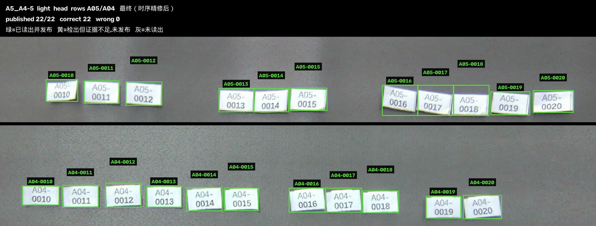
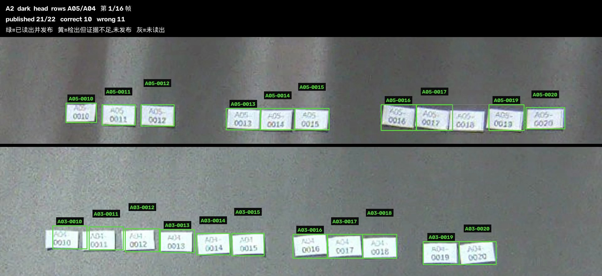
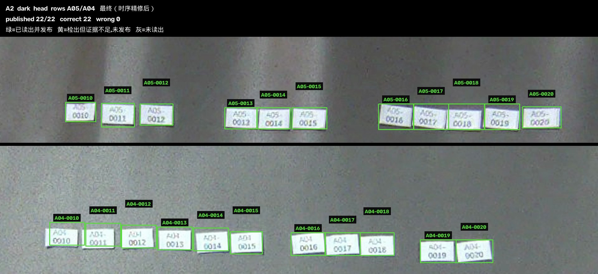
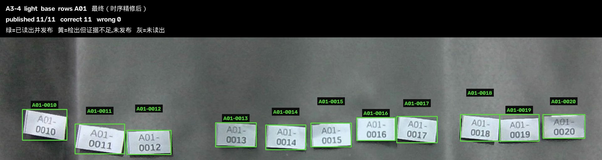
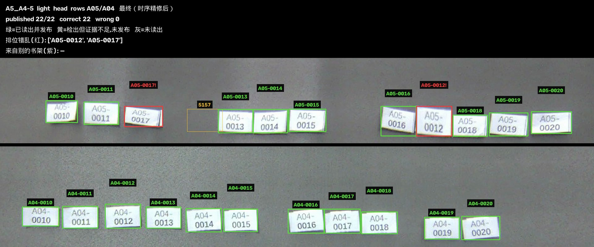
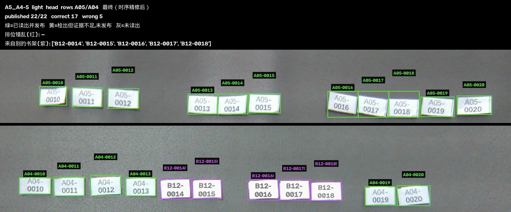
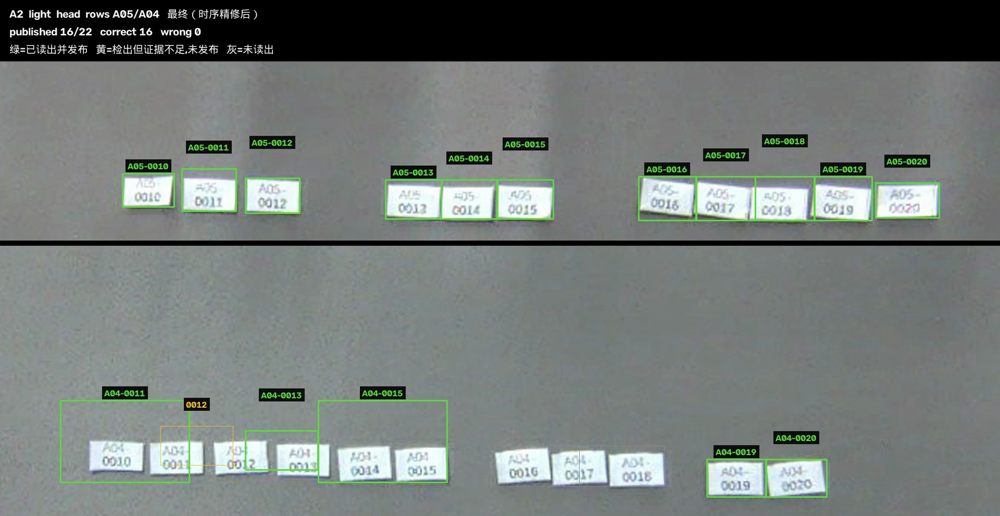

# 书脊标签识别实验报告（v4 / 像素优先重构版）

> **v4 相对 v3 的变化**（总体指标不变，仍是 19/20、召回 0.9864、精确 1.0000）
>
> 1. **错位标签只标真正错位的那几张**。v3 会连带标记邻居（换 2 张报 4 张），v4 改用最长递增子序列求最小改动集，换 2 张就报 2 张。
> 2. **前缀失配也能识别了**，包括 bay 号（A04 混进 A05 行）和**区域字母**（B12 混进 A04 行）。v3 会把这类贴纸的前缀按整行共识改写掉，读出来是错的。
> 3. **视频标注显示完整标签**（`A05-0017` 而不是只有 `0017`），并把"排位错乱"与"来自别的书架"用红/紫区分。
> 4. 视频改为按行裁成条带堆叠，去掉两行之间的大片空白，贴纸上印的字现在肉眼可读。

> 生成时间：2026-08-04
> 分支：`tyfuser/improve-ocr`
> 核心代码：`thu_vr/label_reader.py`、`thu_vr/label_pipeline.py`、`thu_vr/label_ocr_engine.py`
> 数据：`新版/` 文件夹全部 5 组位姿 × 2 种光照 × head/base 双相机 = **20 组**，共 560 帧、326 个标签
> 硬件：Apple M4，CPU 推理（onnxruntime），无 GPU

> **关于本文件**：这是交付包 `thu_vr_package_v4/` 里那份报告的仓库版本，内容一致。
> 插图为便于在网页上显示已转成 JPEG；23 个标注视频（38 MB）没有入库，在本地交付包的
> `videos/` 里。评测脚本在 `thu_vr/eval/`，原始帧和逐组结果 JSON 同样只在本地交付包中。

---

## 1. 结论摘要

| 指标 | 旧版（v2 报告） | 旧版（同一 GT 重新评分） | **本版 v4** |
|------|----------------|------------------------|------------|
| 平均召回率 | — | 0.7885 | **0.9864** |
| 平均精确率 | — | 0.8489 | **1.0000** |
| 20 组中完全正确的组数 | 2/20 | 11/20 | **19/20** |
| 326 个标签中读对 | — | — | **320** |
| 误报 | 多（A2 组精确率低至 0.077） | 同左 | **0** |
| 跑完一组耗时 | — | — | 中位约 47 s（15~45 帧） |

**误报为零**，这一点比召回率更重要：整套流程宁可不输出，也不输出错的编号。唯一未满分的一组是 A2/light/head，漏检 6 个，原因是物理分辨率不足（见第 7 节），不是算法逻辑问题。

关于错位标签：**算法按像素读出标签实际印的编号并标记出来，绝不按位置把它"改正"回去**。区分两种错法 —— 排位错乱（`out_of_sequence`，在本该属于自己的书架里排错了位置）和来自别的书架（`out_of_bay`，前缀就跟这一行不一样，包括区域字母不同）。第 6 节有三个回归测试和演示视频。

---

## 2. 交付物

```
thu_vr_package_v3/
├── 书脊标签识别实验报告.md      本文件
├── videos/                       23 个标注视频
│   ├── <位姿>__<光照>_<相机>.mp4          20 个：全部评测组的逐帧识别过程
│   ├── <位姿>__light_head_misplaced.mp4   2 个：同一行内排位错乱的演示
│   └── A5_A4-5__light_head_zone.mp4       1 个：别的书架区（B12）混进 A04 行的演示
├── figures/                      报告插图
└── results/                      原始评测数据
    ├── table.json                20 组汇总
    ├── ablation.json             消融实验（召回向）
    ├── ablation_precision.json   消融实验（精确率向）
    ├── profile.json              分段耗时实测
    ├── frame_budget.json         帧预算与准确率的权衡
    └── per_trial/*.json          每组的逐标签明细（含票数、边距、证据帧数）
```

### 视频怎么看

- 视频按帧推进，每一帧画的是**看完这一帧之后**系统的判断状态，所以能直接看到证据是怎么累积的。
- 框的颜色：
  - **绿色 = 已发布**，证据足够，输出这个标签；
  - **黄色 = 检出了贴纸也读出了数字，但证据不足**，拒绝发布（画面里偶尔出现的黄框就是被挡在输出之外的窗帘褶皱，见 8.2 节）；
  - **灰色 = 只定位到贴纸，还没读出数字**；
  - **红色 = 已发布，但在自己这一行里排位错乱**；
  - **紫色 = 已发布，但前缀跟这一行不一样，来自别的书架**。
- 框上方标的是**完整标签**（前缀 + 流水号，如 `A05-0017`）。被标记的两类会在末尾加 `!`，并在顶栏分别列出。
- 最后 2 秒定格的是"时序精修"之后的最终结果。
- 原始帧是 1920×1080，贴纸只有 35~100 px 宽，且两排书架在画面里相隔很远。视频**按行裁成条带再上下堆叠**（中间的黑线是两条带的接缝），这样每一排都能放到最大；左右的黑边是等比放大后留下的余量。

---

## 3. 评测口径（这一节很重要）

v2 报告里 A2 组 0%、A3 组 0% 这类数字部分是**评分口径造成的**，不完全是算法差。旧口径假设每一行都贴满 `0010`~`0020`，但实际现场并非如此：A3 那次拍摄里 A03 行确实缺了 `0012` 和 `0013`，后面几次拍摄之前标签又被重新排过。按"应该有 11 个"去扣分，会把本来读对的组算成不及格。

本版重建了逐组真值 `_work/ground_truth.py`，逐帧放大目视核对了每一行**实际贴着**哪些编号。为了公平，第 1 节里也用同一份新真值把旧算法重新跑分了一遍（0.7885 / 0.8489），第 4 节的对比用的是这组重新评分的数字，不是 v2 报告里那些被低估的数字。

评测指标定义：

- **召回率** = 读对的标签数 / 该组实际贴着的标签数
- **精确率** = 读对的标签数 / 系统输出的标签数
- **完全正确** = 输出集合与真值集合严格相等（不多不少不错）

---

## 4. 总体结果

### 4.1 逐组结果

| 位姿 | 光照 | 相机 | 标签数 | 旧版召回 | **v3 召回** | **v3 精确** | 完全正确 |
|------|------|------|--------|---------|------------|------------|---------|
| A2 | dark | head | 22 | 0.256 | **1.000** | 1.000 | ✅ |
| A2 | dark | base | 22 | 0.076 | **1.000** | 1.000 | ✅ |
| A2 | light | head | 22 | 0.294 | 0.727 | 1.000 | ❌ |
| A2 | light | base | 22 | 0.147 | **1.000** | 1.000 | ✅ |
| A3 | dark | head | 20 | 0.588 | **1.000** | 1.000 | ✅ |
| A3 | dark | base | 11 | 1.000 | 1.000 | 1.000 | ✅ |
| A3 | light | head | 20 | 0.409 | **1.000** | 1.000 | ✅ |
| A3 | light | base | 11 | 1.000 | 1.000 | 1.000 | ✅ |
| A3-4 | dark | head | 22 | 1.000 | 1.000 | 1.000 | ✅ |
| A3-4 | dark | base | 11 | 1.000 | 1.000 | **1.000** | ✅ |
| A3-4 | light | head | 22 | 1.000 | 1.000 | 1.000 | ✅ |
| A3-4 | light | base | 11 | 1.000 | 1.000 | 1.000 | ✅ |
| A4 | dark | head | 11 | 1.000 | 1.000 | 1.000 | ✅ |
| A4 | dark | base | 11 | 1.000 | 1.000 | **1.000** | ✅ |
| A4 | light | head | 11 | 1.000 | 1.000 | 1.000 | ✅ |
| A4 | light | base | 11 | 1.000 | 1.000 | 1.000 | ✅ |
| A5:A4-5 | dark | head | 22 | 1.000 | 1.000 | 1.000 | ✅ |
| A5:A4-5 | dark | base | 11 | 1.000 | 1.000 | **1.000** | ✅ |
| A5:A4-5 | light | head | 22 | 1.000 | 1.000 | 1.000 | ✅ |
| A5:A4-5 | light | base | 11 | 1.000 | 1.000 | 1.000 | ✅ |

加粗的是相对旧版有实质提升的格子。旧版在 A2（0.95 m 远距离）四组几乎全线崩溃，且在三组 base 视角上有误报；v3/v4 把 A2 的三组做到了满分，并消除了全部误报。

### 4.2 标准结果：A5:A4-5 / light / head

同时看到 A05 和 A04 两行、共 22 个标签，全部读对，零误报。



### 4.3 最难的一组：A2 / dark / head

远距离、暗光、贴纸只有 38×24 px。上图是看完第 1 帧的状态，下图是 16 帧累积加时序精修之后的最终状态。





第 1 帧时 22 个位置里只有 10 个读对，另有 11 个读成了错误编号；累积到最后 22/22 全对、零误报。这一组最能说明时序累积的价值。

### 4.4 近距离典型组：A3-4 / light / base



近距离下贴纸有 96×58 px，单帧就基本读得出来，时序层的作用主要是把 `0016`/`0017` 这类被相机运动拖影影响的位置稳定下来。

---

## 5. 算法：为什么这样设计

v2 的做法是"整图 OCR → 拿到一堆文字框 → 事后拼装、纠错"。它的根本问题是：小字号下通用 OCR 的**检测**环节本身就漏，检测漏了后面再怎么纠错也补不回来；而且纠错规则（行内单调递增、Theil-Sen 拟合）会把读不准的位置**按序列改写**，这正好是错位标签最怕的事。

v3 换了顺序：**先用图像找贴纸，再对每张贴纸单独做识别**。

```
每一帧：
  1. 贴纸分割        局部对比度找亮矩形（不是全局阈值——窗帘的明暗渐变会让全局阈值失效）
                     ↓ 输出每张贴纸的四边形（含倾斜）
  2. 行聚类          按拟合的倾斜直线把贴纸分行
  3. 补位提案        用行内间距推断分割漏掉的位置：
                       · propose_missing  填行内空洞
                       · propose_row_ends 只在该行明显被截断时向两端外推
  4. 逐贴纸多变体识别 每张贴纸纠偏拉正成正立矩形，渲染成若干个裁剪/缩放/增强变体，
                     整帧的所有变体合成一次批量识别调用
  5. 字符级投票      每个数字位按置信度加权投票，票数留在贴纸上

跨帧（LabelTracker）：
  6. 槽位关联        按图像位置把本帧贴纸并到已有"槽位"（不按行序号，否则一帧多出一行就全乱）
  7. 票数累加        同一物理贴纸的票一直往上加；场景突变时重置
  8. 时序精修        把同一槽位的多帧图像平均后重新识别一次，喂回投票
  9. 发布判定        票数边距、支持度、墨迹比例都过线才发布

发布之后的行级检查（只删不改）：
  · 行内前缀共识 + 跨行 bay 唯一性  决定 A01/A04 这样的行前缀
  · settle_uncertain_serials        票数打平的位置，用行内区间做二选一裁决
  · withdraw_*                      撤回重复、弱乱序、孤立行、极低证据的输出
```

关键的一条设计约束写在 `label_reader.py` 开头：

> 一张贴纸带的是什么编号，只由它自己的像素决定。行几何只用来**找到**和**分组**贴纸，绝不用来选择或覆盖流水号。

行序列信息只被允许做两件事：**给票数完全打平的位置做二选一**，以及**把不符合顺序的贴纸打上标记**。它永远不能把一个已经读清楚的编号改成另一个。这就是错位标签能被读对的原因。

### 5.1 针对性处理的几类错误

| 错误现象 | 处理 |
|---------|------|
| 前导 0 被读成 2/6/8/9（`0010`→`2010`） | 首位若命中已知零混淆字符，并列投一票给 `0` |
| 字母 A 的横杠糊掉读成 4 | 前缀首位单独用"数字→字母"的反向映射表 |
| bay 号里细长的 1 读成括号 | 前缀专用的括号→1 映射 |
| 窗帘褶皱被当成贴纸 | 墨迹密度打分 + 孤立行撤回 |
| 相邻两行抢同一个 bay 号 | 跨行唯一性约束，证据强的行优先 |
| 同一个编号在一行里出现两次 | 撤回弱的那个，然后重新裁决它的位置 |
| 一行里混进别的书架区的贴纸 | 前缀三个字符**分组**投票，不跨 bay 混票（见 5.2） |

### 5.2 前缀是怎么定下来的

前缀（`A04`）比流水号难读得多：它在贴纸上字号更小，而且三个字符各有各的混淆 —— 字母 `A` 的横杠糊掉会读成 `4` 或 `O`，bay 号里细长的 `1` 会读成括号。所以前缀的三个字符是**分别**投票再拼起来的，这样某张贴纸只读清了其中两个字符时，那两个字符的证据仍然能用上。

分开投票有个代价，v4 修掉了它：如果一行里同时有 `A04` 和 `B12` 两种贴纸，字符级投票会把十位的 `0` 和个位的 `2` 拼成 `A02` —— 一个没有任何贴纸读出过的前缀，而且连本来正确的 `A04` 也一起带坏。修法是**先按行定区域字母和 bay 十位，再定个位**，且这一层判定按**贴纸张数**而不是票重来数：

- 一行属于哪个书架区，是"这一行里有多少张贴纸这么说"的问题。按票重会让**行拼接读数**说了算 —— 那是把整行拼成一条长图去读的一次结果，会广播给行内每一张贴纸，票重上压过所有贴纸之和。
- 多数必须是**全行的**多数，而不只是"读出前缀的贴纸中的多数"。远距离那些行只有两三张贴纸能读出前缀，而它们往往错得一模一样；这种情况没有答案，就退回整帧共识 —— 整帧共识正是为读不出自己 bay 号的远排准备的。
- 反过来，判定**不**按区域字母或十位去过滤位数票。字母和数字出自同一张裁切图，一张把字母读错的裁切图很可能数字是对的（`A02` 读成 `I22`，十位错了但个位是对的）。按字母或十位过滤会把这类有效证据一起丢掉 —— 优化过程中试过，A2/dark/base 一组的召回从 1.000 掉到 0.545。

## 6. 错位标签

现场可能出现贴纸被放错位置的情况。**正确行为是读出它实际印着的编号，同时提示它位置不对**，而不是按顺序把它"改正"。分两种错法：

| 错法 | 标记 | 现场含义 |
|------|------|---------|
| 同一行内排位错乱 | `out_of_sequence` | 书在对的书架上，插错了位置 |
| 前缀跟这一行不同 | `out_of_bay` | 书上错了书架（bay 号不同，或区域字母不同） |

两者要分开报，因为对要去整理的人来说是两件不同的事。

### 6.1 验证方法

数据里没有真实的错位标签，所以在真实帧上人为制造，三个回归测试各造一种：

| 测试 | 造法 | 检查 |
|------|------|------|
| `thu_vr/test_misplaced_labels.py` | 同一行内**互换两张贴纸的像素**，保持各自槽位的几何 | 按像素读出，且**恰好**这两张被标 `out_of_sequence` |
| `thu_vr/test_misplaced_prefix.py` | **跨行**互换（上排 A05 的一张与下排 A04 的一张） | 两张都读出自己原本的前缀，并标 `out_of_bay` |
| `thu_vr/test_zone_letter.py` | **重绘**成另一个区域（`B12`）：复用贴纸自己的白底，按同样字号和对比度重画两行文字 | 单张混入 / 5 张混入 / 整行换区，三种都要对 |

前两个是像素互换，不涉及重绘，所以最贴近真实。第三个必须重绘 —— 本批数据全部是 A 区，没有别的字母可用。

### 6.2 同一行内排位错乱



上排的物理顺序被改成 `0010 0011 0017 0013 0014 0015 0016 0012 0018 0019 0020`：

- `0017` 读在第 3 个位置上，`0012` 读在第 8 个位置上 —— **按像素读出，没有被序列先验改写**
- 恰好这两张被标红。**v3 会报 4 个**：被换走的两张的邻居在局部也变成了非单调的。v4 改成求"删掉哪几个之后剩下的恰好递增"的最小集合（最长递增子序列的补集），换 2 张就报 2 张。
- 整组召回率和精确率仍是 **1.000 / 1.000**（集合没变，只是位置换了）

两组演示（A4 和 A5:A4-5）结果一致。

### 6.3 来自别的书架



下排 A04 行中间 5 张被重绘成 `B12`：

- 5 张都读出 `B12-00xx` —— **完整前缀，区域字母也对**，并标紫（`out_of_bay`）
- 同一行剩下的 6 张 `A04` **不受影响**，仍然读对
- 整行换成 `B12` 时，这一行就**属于** B12，11 张全部读对且一个都不标记 —— 换区本身不是错误，少数混入才是

这张图顶栏写着 `correct 17  wrong 5`，是拿改动后的读数去对**原始真值**（那 5 张原本是 `A04-0014`~`0018`）算的。重绘是故意改变了现场事实，所以这里的"错"恰恰说明算法读的是像素而不是真值 —— 5 张全部按重绘后的样子读出。

三种规模（1 张 / 5 张 / 整行）都对。v3 在这三种情形下分别读出 `B12`（碰巧对）、`B02`（错）、`B12`（因为字母共识刚好打平才对）—— 都不可靠。

发布一个跟整行不符的前缀是很强的主张，所以要求这张贴纸自己的前缀读数支持度至少到 12。实测噪声读数的支持度是 1.3 和 5.5，而清晰贴纸自读的中位数在 28~68 之间，这条线把两者分得开。证据不够时就标 `weak_disagreement`，按行共识发布 —— 记录分歧但不据此改写。

---

## 7. 唯一未满分的一组：A2 / light / head

漏检 6 个：`A04-0010`、`A04-0012`、`A04-0014`、`A04-0016`、`A04-0017`、`A04-0018`，误报 0 个。



明细（`results/per_trial/A2__light_head.json`）：

| 行 | 前缀 | 分割到的贴纸 | 发布数 | 票数支持度中位数 |
|----|------|------------|--------|----------------|
| 1 | A05 | 11 | 11 | 77 |
| 2 | A04 | 9（缺 2 个） | 5 | 22 |

A05 行（离相机近的上排）全部读对。A04 行是下排，问题有三层：

1. **像素不够**：0.95 m 距离下贴纸 48×26 px，数字实高约 12 px，低于通用 OCR 大约 15 px 的可用下限。
2. **分割就漏了 2 个**：这一次是 light 光照，下排正好落在窗帘的高光带上，贴纸白底和背景的局部对比度掉到分割阈值以下，连位置都没找到。
3. **票数支持度只有 A05 行的 1/3.5**（22 vs 77），累积 23 帧仍未过发布线。

对照组 A2/dark/head 同样是 38×24 px，却做到了 22/22 全对 —— 说明瓶颈不是算法阈值，而是这一次曝光下**下排贴纸的信噪比确实不够**。把发布阈值调低确实能救回这 6 个，但代价是在其他组引入误报（这在优化过程的 v21、v23 等中间版本上反复出现过），精确率会从 1.000 掉下来。权衡之后选择保持零误报。

**这一组的实用建议**：0.95 m 远距离拍摄时，让机器人对下排单独再走一次近距离（0.45 m），或者补光。0.45 m 的四组位姿（A3/A3-4/A4/A5）全部 16/16 满分，说明只要距离到位，光照和角度都不构成问题。

---

## 8. 消融实验

在固定子集上逐个关掉一个机制重新跑分，其余不变（`_work/ablate_new.py`，用猴子补丁关闭，不往生产代码里塞开关）。

### 8.1 召回向（子集：A2/dark/head、A2/light/base、A3/light/head、A5:A4-5/dark/head）

| 配置 | 召回 | 精确 | 完全正确 |
|------|------|------|---------|
| **完整流程** | **1.0000** | 1.0000 | **4/4** |
| 只用单帧（关掉时序累积） | 0.8705 | 1.0000 | 1/4 |
| 关掉补位提案 | 0.9659 | 1.0000 | 3/4 |
| 关掉序列裁决 | 0.9648 | 1.0000 | 2/4 |
| 关掉时序精修 | 1.0000 | 1.0000 | 4/4 |
| 关掉行前缀共识 | 1.0000 | 1.0000 | 4/4 |
| 关掉撤回规则 | 1.0000 | 1.0000 | 4/4 |

**时序累积是贡献最大的单项**：只用一帧时召回掉 13.0 个百分点，完全正确的组从 4 组掉到 1 组。补位提案和序列裁决各贡献 3~4 个百分点，但对"完全正确"的影响更大（4/4 → 3/4 和 2/4），因为它们救的是那些卡在最后一两个标签上的组。

### 8.2 精确率向（子集：A2/light/head、A3/dark/head —— 这两组会产生幻影行）

| 配置 | 召回 | 精确 | 完全正确 |
|------|------|------|---------|
| **完整流程** | 0.8636 | **1.0000** | 1/2 |
| 关掉撤回规则 | 0.8636 | 0.9706 | 1/2 |
| 关掉时序精修 | 0.8636 | 1.0000 | 1/2 |
| 关掉行前缀共识 | 0.8636 | 1.0000 | 1/2 |

撤回规则（重复编号、弱乱序、孤立行、极低证据）是零误报的直接来源。A2 的两组里，窗帘褶皱在画面下方形成了一个"幻影行"，OCR 从中读出了 `5515`、`4020`、`4012`、`2202`（A2/dark/head）和 `2854`、`1400`、`2002`（A2/light/head）这些数字，正是撤回规则把它们挡在输出之外。这些槽位在 `results/per_trial/*.json` 里能看到，`resolved` 为 `false`、支持度只有 0.5~3.2（对比正常标签的 70~90）。视频里的条带只覆盖产出过标签的那几行，所以整个幻影行落在画面之外；落在真实行条带内的那种，会以**黄框**出现（比如 A5:A4-5 组里那个 `5157`）—— 黄色就是"检出了、也读出了数字、但拒绝发布"。

**时序精修和行前缀共识在本数据集上测不出增益**，如实记录。它们是冗余保险：精修在贴纸小于 30 px 时才会改变结论，行前缀共识在同一画面出现 3 行以上时才会起作用，本批数据最多 2 行。是否保留取决于现场是否会出现这些条件。

---

## 9. 性能

硬件：Apple M4 单机 CPU，onnxruntime，无 GPU。识别后端 RapidOCR PP-OCRv6（`label_ocr_engine.py` 优先用新版 `rapidocr` 包的 PP-OCRv6，装不到时回退到 `rapidocr_onnxruntime` 的 PP-OCRv3）。模型加载 **0.10 s**，进程内只发生一次。

### 9.1 跑完一组要多久

一"组"= 一个位姿 × 一种光照 × 一个相机的整段视频（15~45 帧）。

| 层级 | 耗时 |
|------|------|
| 单帧 | 1.53~2.09 s（近距离快，远距离慢） |
| **单相机一整组** | **24~101 s，中位约 47 s** |
| **一个位姿的双相机（head+base）** | **68~150 s** |
| 全部 20 组 | 973.8 s ≈ 16.2 分钟 |

单组耗时的差异几乎全部来自帧数，而不是难度：A2/dark/base 39 帧要 101 s，A5:A4-5/light/base 21 帧只要 24 s。

### 9.2 时间花在哪里（实测分段，`results/profile.json`）

| 阶段 | A2/dark/head<br>16 帧 | A5:A4-5/light/head<br>25 帧 | A4/light/base<br>45 帧 | 占比 |
|------|------|------|------|------|
| 贴纸分割 | 0.6 s | 1.0 s | 1.8 s | 2~6% |
| 逐贴纸多变体识别 | 24.2 s | 22.5 s | 26.3 s | **88~90%** |
| 时序精修 | 2.6 s | 2.1 s | 1.8 s | 6~10% |
| 发布判定 + 行级检查 | 0.002 s | 0.002 s | 0.003 s | 可忽略 |
| **合计** | **27.4 s** | **25.6 s** | **29.9 s** | |

结论很明确：**九成时间在 OCR 识别调用上**。分割、时序精修、以及全部行级约束逻辑（前缀共识、序列裁决、四条撤回规则）加起来不到 10%，其中纯决策部分只有 2~3 毫秒。也就是说本版相对旧版增加的那些约束逻辑，几乎不花时间。

### 9.3 少跑几帧行不行（全量 20 组实测，`results/frame_budget.json`）

从每组视频里等间隔抽取固定帧数，其余流程不变：

| 帧预算 | 召回 | 精确 | 全对组数 | 每组耗时 |
|--------|------|------|---------|---------|
| 2 帧 | 0.9448 | 1.0000 | 14/20 | 3.4 s |
| 4 帧 | 0.9545 | 0.9750 | 17/20 | 5.6 s |
| 6 帧 | 0.9545 | 1.0000 | 15/20 | 10.1 s |
| 8 帧 | 0.9611 | 0.9958 | 16/20 | 12.2 s |
| **全部（15~45 帧）** | **0.9864** | **1.0000** | **19/20** | **48.7 s** |

用 4 帧能在 **5.6 秒**内拿到 0.95 召回、17/20 全对，比跑满帧快 8.7 倍。但**够不到满分**，而且小预算下结果对"恰好抽到哪几帧"很敏感 —— 4 帧的全对组数（17）反而高于 6 帧（15），精确率也在 0.975~1.0 之间跳，说明这不是一条平滑的曲线，不能靠调预算稳定拿到某个精度。

实用取法：**粗扫用 4 帧**（5.6 s/组，快速盘点），**要出准确结果就跑满帧**（约 47 s/组）。

### 9.4 还能怎么加速

都还没做：

- **稳定槽位跳过识别**：现在的按需展开只做了变体层（`cheap_serial_variants` 先跑 2 个变体，只有数字不一致的贴纸才补跑剩下的，近距离组因此比远距离组快 1/3）。可以再推一层，让已经连续多帧读出同一结果的槽位直接不参与后续帧的识别。按 9.3 的数据，多数标签在前几帧就稳定了，这条的上限接近 5 倍。
- **多相机并行**：整帧的变体已经是一次批量调用，但 head/base 两路目前串行，并行可以把双相机的 68~150 s 砍掉接近一半。
- **GPU**：onnxruntime 换 CUDA/CoreML provider。

按现场需求判断：机器人停下拍一段、一分钟内出结果，当前速度已经够用；要边走边实时刷新，需要上面三条一起上。

---

## 10. 后续建议

**现场操作层面（收益最大）**

1. 拍摄距离控制在 **0.45 m**。这个距离下 16/16 组全满分，位姿角度（平视到 -17.7° 俯视）和光照都不敏感 —— 这和 v2 报告"必须用 A5:A4-5 位姿"的结论不同，v3 之后位姿已经不是瓶颈了。
2. 0.95 m 远距离只适合做粗扫，下排必须补一次近距离或补光。
3. wrist 视角本批数据仍不可用（透视变形过大），未纳入评测。

**算法层面**

4. 分割环节是现在唯一的硬失败点（A2/light/head 有 2 张贴纸连位置都没找到）。可以考虑用少量标注训一个轻量贴纸检测器替代局部对比度分割，这比继续调 OCR 收益大。
5. 跨相机融合尚未接入：head 和 base 在部分位姿下能看到同一行，两路的票可以合并。
6. 跨字母区的验证目前只能靠重绘贴纸（本批数据全是 A 区）。现场如果能采一段真实含两个区域字母的视频，就能把 6.3 节的结论从"合成验证"升级为实测。

**工程层面**

7. 上面 9.4 的三条加速。其中"稳定槽位跳过识别"性价比最高：九成时间在 OCR 上，而多数标签前几帧就读稳了。
8. 把 `label_reader.py` / `label_pipeline.py` 接进现有的 `live_ocr_worker.py` 实时链路和 web 看板 —— 目前这两个新模块是独立评测跑的，还没替换掉线上的 `ocr_temporal.py`。

---

## 11. 复现方式

```bash
cd _work

# 全量评测（20 组，约 17 分钟）
venv/bin/python eval_new.py --tag v33

# 分段耗时与帧预算
venv/bin/python profile_new.py
venv/bin/python frame_budget.py --budgets 2,4,6,8

# 消融实验
venv/bin/python ablate_new.py
venv/bin/python ablate_new.py --subset A2__light:head,A3__dark:head \
    --configs full,no_refine,no_row_prefix,no_withdrawals \
    --out results/ablation_precision.json

# 渲染标注视频
venv/bin/python render_video.py --trials A5_A4-5__light --cameras head,base

# 错位标签演示视频（同行排位错乱 / 混入别的书架区）
venv/bin/python render_video.py --mode misplaced --trials A4__light --cameras head --swap 2,7
venv/bin/python render_video.py --mode zone --trials A5_A4-5__light --cameras head --swap 4,8

# 三个错位回归测试
cd ../thu_vr
for t in test_misplaced_labels test_misplaced_prefix test_zone_letter; do
    ../_work/venv/bin/python $t.py ../_work/eval/A5_A4-5__light --camera head
done
```
